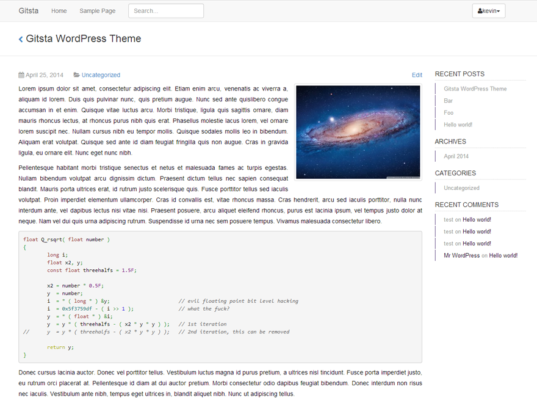

gitsta
======
Responsive, minimalistic, clean and content-oriented theme, inspired by GitHub. Mainly designed for programmers, but suitable for any bloggers. With shortcodes for bootstrap and lots of icons (font awesome, octicons and glyphicons)!

[Live Demo](http://www.doecode.net)

### Download
- [GitHub Releases](https://github.com/HirczyK/gitsta/releases)
- [WordPress.org](https://wordpress.org/themes/gitsta)

### Shortcodes
__To use shortcodes, you must first enable them in theme options!__
See [Gitsta Shortcodes](http://doecode.net/gitsta-shortcodes/)

##### Additional
- Enable markdown support for comments (markdown preview & help) via Admin > Appearance > Gitsta (there aren't that many options :))

### Requirements & Recommendation
* This theme requires at least PHP 5.3, due the usage of closures within the `functions.php`
* Since this theme was created with markdown in mind, you should use some kind of markdown plugin (I'm pretty satisfied with [WP-Markdown](https://wordpress.org/plugins/wp-markdown/)). If you don't like to use markdown, you can disable the markdown support within the theme settings.

### Like the theme?
Rate it on [WordPress.org](https://wordpress.org/themes/gitsta) or star it on [GitHub](https://github.com/HirczyK/gitsta)! Thanks!

### Credits
* [Bootstrap](http://www.getbootstrap.com)
* [GitHub](http://www.github.com)
* [Marked](https://github.com/chjj/marked)
* [Font Awesome](http://fortawesome.github.io/Font-Awesome/)
* [TGM Plugin Activation](http://tgmpluginactivation.com/)